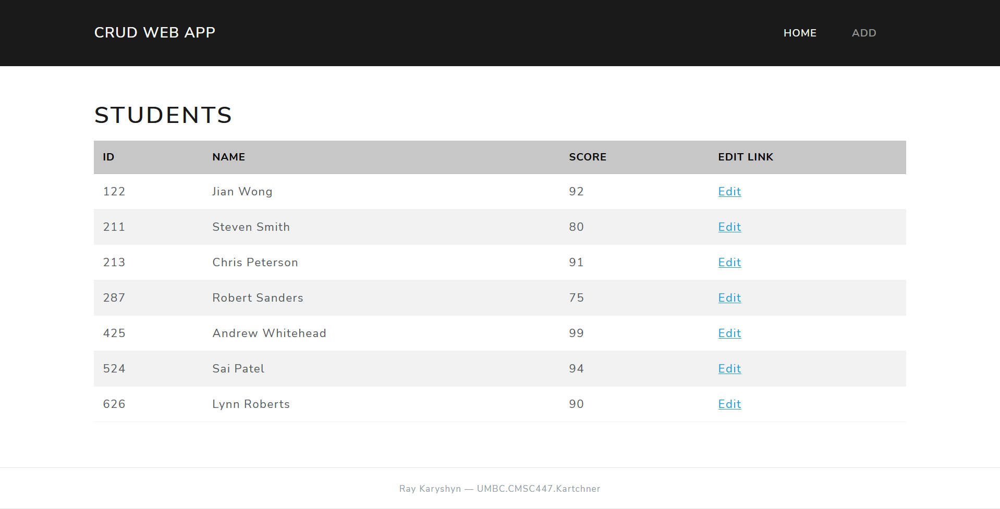

# CMSC 447: HW 2 (CRUD Web App)

I used a virual environment to install Flask and SQLAlchemy. It can be replicated with the following commands:

- `python3 -m venv hw2`: Create a virtual environment called *hw2*
- `source hw2/bin/activate`: Activate the *hw2* venv 
- `pip3 install flask sqlalchemy flask-sqlalchemy`: Install Flask and SQLAlchemy 
    - `pip3 install -r requirements.txt`: Or, use the *requirements.txt* file

The app can then be ran inside the *hw2* venv:

- `python3 init_db.py`: Initialize and populate the SQLite database (*database.db*)
- `python3 app.py`: Run the Flask web app and navigate to the "Running on" server in a web browser
